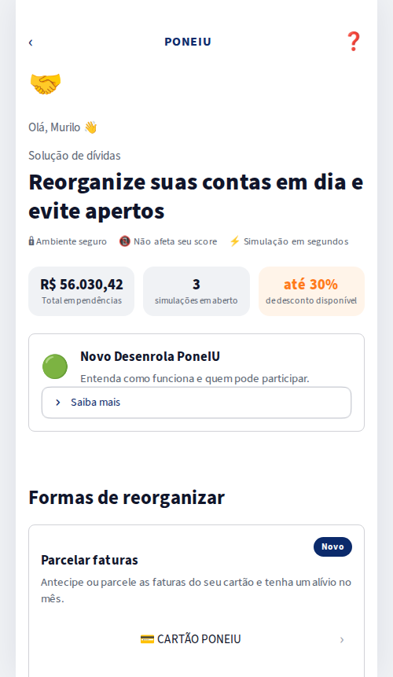
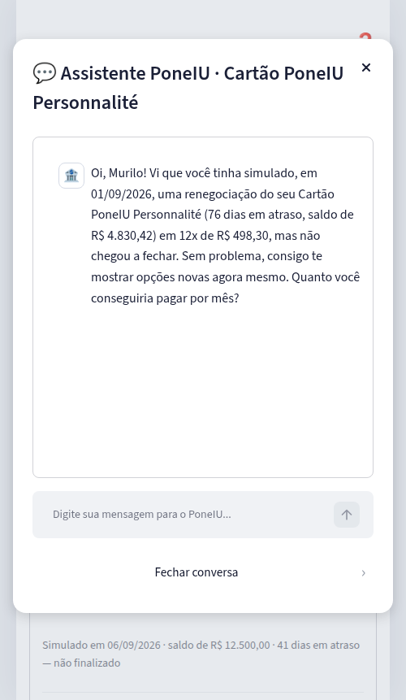
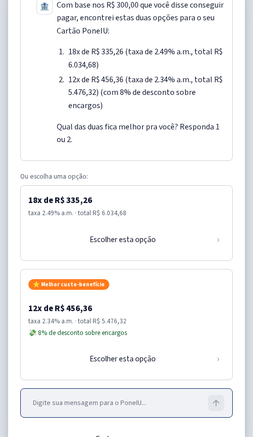
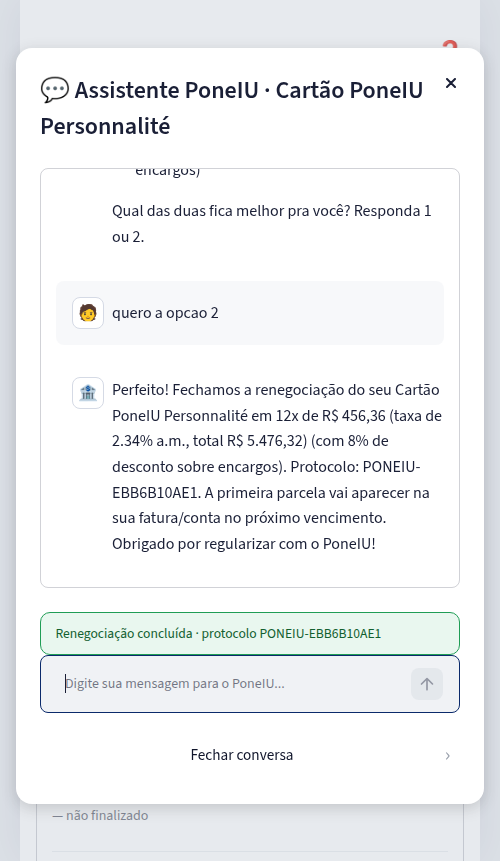
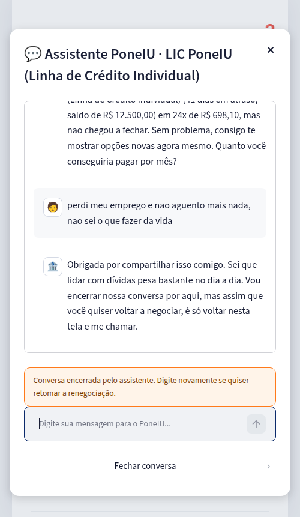

# PoneIU · Ecossistema agêntico de renegociação de carrinho abandonado


Simulação completa — agentes de IA + interface bancária — de um fluxo real
de **retomada de renegociação de dívida** para um banco fictício chamado
**PoneIU**. O cliente entra na tela de "Solução de dívidas", clica em uma
simulação que ele começou e não contratou (um "carrinho abandonado") e
conversa com um ecossistema de agentes construído em **LangGraph** que:

1. Filtra, de forma humana, qualquer mensagem que **não** seja sobre
   retomar a negociação (inclusive desabafos sobre dificuldade financeira)
   e encerra a conversa com empatia — sem fingir ser um consultor
   financeiro completo.
2. Quando o cliente quer mesmo retomar, conduz a negociação: pergunta
   quanto ele pode pagar por mês e devolve, via uma **API mock do PoneIU**,
   as **duas ofertas mais próximas** daquele valor (cartão, LIC ou
   Pronampe).
3. Confirma a escolha do cliente e "contrata" a oferta, gerando um
   protocolo — como um sistema bancário real faria.

A interface é feita em **Streamlit** e reproduz o layout de uma tela real
de app bancário de soluções de dívidas (referência de design fornecida
pelo usuário).

| Tela principal | Chat — abertura | Chat — ofertas | Chat — confirmação | Chat — gatekeeper humanizado |
|---|---|---|---|---|
|  |  |  |  |  |

> Para a teoria por trás da arquitetura (por que LangGraph, desenho do
> grafo, onde o LLM entra e onde ele deliberadamente não entra, etc.), veja
> **[docs/ARQUITETURA.md](docs/ARQUITETURA.md)**.

---

## Sumário

- [Como rodar](#como-rodar)
- [Rodando com ou sem chave de API (modo simulado)](#rodando-com-ou-sem-chave-de-api-modo-simulado)
- [Rodando os testes](#rodando-os-testes)
- [Estrutura do projeto](#estrutura-do-projeto)
- [Como usar a demo](#como-usar-a-demo)
- [Aviso importante](#aviso-importante)

## Como rodar

Pré-requisito: Python 3.11+.

```bash
# 1. Clone o repositório
git clone <url-do-seu-repo>
cd poneiu-renegocia-agentic

# 2. Crie e ative um ambiente virtual
python3 -m venv .venv
source .venv/bin/activate        # Windows: .venv\Scripts\activate

# 3. Instale as dependências
pip install -r requirements.txt

# 4. (Opcional) configure sua chave da Anthropic para respostas via LLM real
cp .env.example .env
# edite .env e preencha ANTHROPIC_API_KEY=sk-...

# 5. Rode a aplicação
streamlit run app.py
```

O Streamlit vai abrir automaticamente `http://localhost:8501` no navegador.

## Rodando com ou sem chave de API (modo simulado)

O ecossistema **funciona sem nenhuma chave de API**. Se
`ANTHROPIC_API_KEY` não estiver definida em `.env`, todos os agentes caem
para um **modo simulado** determinístico:

- O classificador de intenção usa uma heurística por palavras-chave.
- As respostas humanizadas do agente geral usam textos de encerramento
  pré-escritos (variados, não um script único repetido).
- As mensagens do agente de renegociação (saudação, ofertas, confirmação)
  já são escritas em tom natural nos templates — o LLM, quando disponível,
  só dá um verniz extra de naturalidade, nunca altera os números.

Isso permite clonar o repositório e testar o fluxo inteiro **sem custo e
sem credenciais**. Com a chave configurada, o agente geral passa a gerar
as respostas de acolhimento/encerramento com Claude (modelo configurável
via `PONEIU_MODEL_NAME` no `.env`, padrão `claude-sonnet-5`).

## Rodando os testes

```bash
pip install -r requirements-dev.txt
pytest
```

Os testes cobrem a API mock (determinismo, seleção das ofertas mais
próximas), os utilitários de extração de valor/escolha em linguagem
natural, e o grafo de agentes de ponta a ponta (fluxo feliz, encerramento
humanizado, reabertura de conversa) — tudo em modo simulado, sem exigir
chave de API.

## Estrutura do projeto

```
.
├── app.py                        # streamlit run app.py
├── src/
│   ├── config.py                 # variáveis de ambiente e marca PoneIU
│   ├── utils.py                  # extração de valor/escolha, formatação BRL
│   ├── domain/
│   │   └── models.py             # Produto, CarrinhoAbandonado, OfertaRenegociacao, ...
│   ├── services/
│   │   └── poneiu_api.py         # mock da API core-banking do PoneIU
│   ├── agents/
│   │   ├── state.py              # AgentState (TypedDict) e Estagio (enum)
│   │   ├── prompts.py            # personas e instruções dos agentes
│   │   ├── llm.py                # acesso ao Claude + fallback simulado
│   │   ├── agente_geral.py       # gatekeeper/triagem
│   │   ├── agente_renegociacao.py# especialista (máquina de estados)
│   │   ├── graph.py              # montagem do StateGraph do LangGraph
│   │   └── orquestrador.py       # fachada usada pela UI
│   └── ui/
│       ├── styles.py             # CSS (layout "app bancário")
│       └── components.py         # telas e a "janelinha" de chat (st.dialog)
├── tests/                        # pytest
└── docs/
    ├── ARQUITETURA.md            # teoria e racional de design
    └── screenshots/
```

## Como usar a demo

1. Na tela principal, veja a seção **"Formas de reorganizar"** com as
   simulações não finalizadas: Cartão, LIC e Pronampe.
2. Clique em uma delas — isso abre a "janelinha" de chat já contextualizada
   com o produto e a oferta que você tinha visto antes.
3. Digite quanto você conseguiria pagar por mês (ex.: `"consigo pagar uns
   300 por mês"`).
4. Escolha uma das duas ofertas apresentadas (`"1"`, `"2"`, `"a segunda"`,
   ...).
5. Pronto — a renegociação é "contratada" e um protocolo é gerado.

Para ver o comportamento do agente geral, abra qualquer carrinho e escreva
algo que não seja sobre retomar a negociação (ex.: `"perdi meu emprego e
não sei o que fazer"`) — a conversa recebe uma resposta humana e é
encerrada, convidando o cliente a voltar quando quiser.

## Aviso importante

**PoneIU é um banco fictício.** Todos os dados (clientes, saldos, taxas,
ofertas, protocolos) são gerados por uma API mock local, sem nenhuma
chamada a sistemas bancários reais. Este projeto é educacional/demonstrativo
— não deve ser usado como base para decisões de crédito reais sem uma
revisão completa de compliance, segurança e regulação (Bacen, LGPD, etc.).

## Licença

[MIT](LICENSE).
