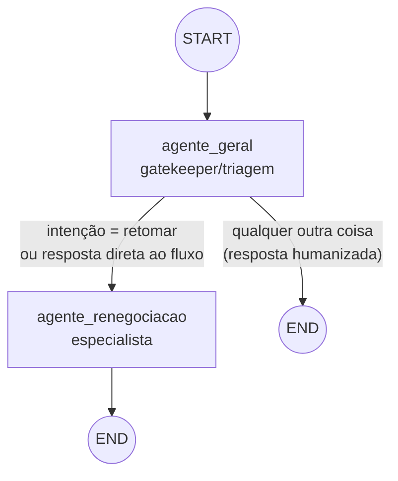
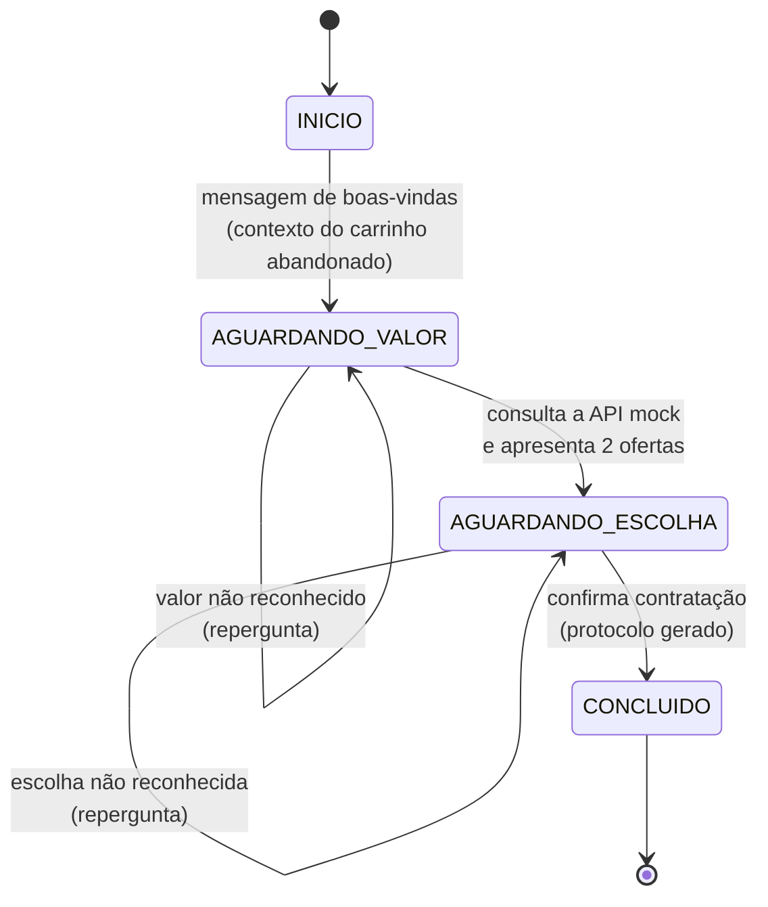

# Arquitetura do ecossistema agêntico PoneIU

Este documento explica **como** o sistema foi construído e, principalmente,
**por quê** — as decisões de design, a teoria de LangGraph por trás delas, e
os trade-offs que foram conscientemente aceitos por se tratar de um projeto
de demonstração/portfólio, não de um sistema em produção.

Índice:

1. [Visão geral do domínio](#1-visão-geral-do-domínio)
2. [Por que LangGraph, e a teoria por trás do grafo](#2-por-que-langgraph-e-a-teoria-por-trás-do-grafo)
3. [Topologia do grafo](#3-topologia-do-grafo)
4. [O agente geral (supervisor/gatekeeper)](#4-o-agente-geral-supervisorgatekeeper)
5. [O agente de renegociação (especialista)](#5-o-agente-de-renegociação-especialista)
6. [Estado e persistência (checkpointer)](#6-estado-e-persistência-checkpointer)
7. [Onde o LLM entra — e onde ele deliberadamente NÃO entra](#7-onde-o-llm-entra--e-onde-ele-deliberadamente-não-entra)
8. [A API mock do PoneIU](#8-a-api-mock-do-poneiu)
9. [Camada de apresentação (Streamlit)](#9-camada-de-apresentação-streamlit)
10. [Limitações conhecidas e próximos passos](#10-limitações-conhecidas-e-próximos-passos)

---

## 1. Visão geral do domínio

O cenário simulado: um cliente do banco fictício **PoneIU** já havia entrado
no app, simulado uma renegociação de dívida (cartão, LIC ou Pronampe), viu
as condições e **não contratou** — um "carrinho abandonado" de
renegociação. Ele volta à tela de "Solução de dívidas", vê a lista de
simulações não finalizadas e decide retomar uma delas.

O ecossistema de agentes precisa fazer três coisas bem feitas:

1. **Reconhecer** quando o cliente realmente quer retomar a negociação
   (e só nesse caso avançar para a parte transacional).
2. **Tratar com humanidade** qualquer outra coisa que o cliente diga —
   principalmente desabafos sobre dificuldade financeira — sem fingir ser
   um consultor financeiro completo nem inventar condições de crédito.
3. **Conduzir a renegociação** de forma determinística e auditável: pedir
   quanto o cliente pode pagar, consultar o "sistema" (API mock) e devolver
   as duas ofertas mais aderentes.

## 2. Por que LangGraph, e a teoria por trás do grafo

Um chatbot bancário transacional não é um problema de "uma chamada de LLM
resolve tudo" — ele é uma **máquina de estados conversacional** com regras
de negócio rígidas (nunca inventar taxa de juros, sempre seguir a
sequência pedir-valor → mostrar-opções → confirmar) intercaladas com
trechos que se beneficiam de linguagem natural flexível (acolher um
desabafo, redigir uma mensagem com tom humano).

[LangGraph](https://langchain-ai.github.io/langgraph/) foi escolhido porque
modela exatamente esse híbrido:

- **Grafo de estados explícito**: nós são funções Python determinísticas
  (podem chamar um LLM ou não); arestas condicionais decidem o próximo nó
  com base no estado atual. Isso é diferente de um "agent loop" onde um
  único LLM decide livremente qual ferramenta chamar a cada passo — aqui,
  quem decide o fluxo é o **código**, e o LLM é convocado pontualmente
  dentro de cada nó. Para um fluxo bancário regulado, esse controle
  explícito é uma escolha deliberada, não uma limitação.
- **Estado tipado e compartilhado** (`AgentState`, um `TypedDict`): todos os
  nós leem e escrevem no mesmo "quadro branco", com reducers explícitos
  (`add_messages` para o histórico de chat) definindo como atualizações
  parciais se combinam com o estado anterior.
- **Checkpointer plugável**: LangGraph persiste o estado entre invocações
  por `thread_id`, dando de graça o comportamento de "memória de conversa"
  que um chatbot real precisa, sem o desenvolvedor ter que implementar cache
  de sessão na mão. Ver [seção 6](#6-estado-e-persistência-checkpointer).
- **Multiagente por composição de grafos**: cada "agente" aqui é, na
  prática, um nó (ou pequeno subconjunto de nós) com sua própria persona e
  responsabilidade. Isso segue o padrão *supervisor* descrito na própria
  documentação do LangGraph para sistemas multiagente: um nó orquestrador
  decide para qual especialista rotear, em vez de um único agente
  monolítico tentar fazer tudo.

## 3. Topologia do grafo



Implementado em [`src/agents/graph.py`](../src/agents/graph.py):

```python
builder = StateGraph(AgentState)
builder.add_node("agente_geral", nodo_agente_geral)
builder.add_node("agente_renegociacao", nodo_agente_renegociacao)

builder.add_edge(START, "agente_geral")
builder.add_conditional_edges(
    "agente_geral",
    rotear_apos_triagem,
    {"renegociacao": "agente_renegociacao", "fim": END},
)
builder.add_edge("agente_renegociacao", END)
```

O grafo é invocado **uma vez por mensagem do cliente** (o padrão
"turn-by-turn" recomendado pelo LangGraph para chatbots): a UI chama
`grafo.invoke({"messages": [nova_mensagem]}, config={"thread_id": ...})`,
o `agente_geral` sempre roda primeiro, e a aresta condicional decide se o
turno termina ali (resposta humanizada) ou segue para o especialista.

## 4. O agente geral (supervisor/gatekeeper)

Arquivo: [`src/agents/agente_geral.py`](../src/agents/agente_geral.py).

Este nó implementa literalmente a regra de negócio pedida no escopo do
projeto: **qualquer mensagem que não seja sobre retomar a renegociação
recebe uma resposta humana e encerra a conversa.** A implementação segue
esta ordem de decisão a cada turno:

1. **A renegociação já foi concluída?** Não reclassifica nada — repassa
   para o especialista, que sabe responder com o protocolo final. Isso
   evita duplicar lógica de "já terminou" em dois lugares.
2. **A conversa tinha sido encerrada humanizadamente antes?** Um
   encerramento não é permanente: se o cliente voltar e demonstrar
   intenção clara de retomar, a triagem roda de novo do zero.
3. **Estamos no meio do fluxo, aguardando um dado específico** (o valor que
   o cliente pode pagar, ou a escolha entre as duas ofertas)? Se a
   mensagem **é reconhecível como essa resposta** (um valor em reais, ou
   "1"/"2"/"a primeira"/"a segunda"), pulamos direto para o especialista
   **sem** chamar o classificador de intenção. Isso é importante: um
   classificador genérico de "retomar vs. outro" tende a não saber o que
   fazer com uma resposta como `"300"` — pular essa reclassificação evita
   falsos negativos.
4. **A resposta não foi reconhecida, mas contém um sinal explícito de
   desistência/desabafo** ("perdi o emprego", "não aguento mais", "quero
   cancelar", etc.)? Aí sim a conversa é encerrada com uma resposta
   humanizada. Uma resposta apenas incerta ("não sei", "sei lá") **não**
   encerra a conversa — ela é passada ao especialista, que sabe reperguntar
   com naturalidade. Essa distinção foi um ajuste deliberado depois de
   testar o fluxo: encerrar a conversa toda vez que o cliente hesita seria
   uma péssima experiência para um chatbot bancário real.
5. Só quando nada acima se aplica é que o **classificador de intenção**
   (`classificar_intencao`, [seção 7](#7-onde-o-llm-entra--e-onde-ele-deliberadamente-não-entra))
   é chamado para decidir entre `retomar_renegociacao` e `outro`.

```python
def rotear_apos_triagem(state: AgentState) -> str:
    if _estagio_atual(state) == Estagio.ENCERRADO_HUMANO:
        return "fim"
    return "renegociacao"
```

## 5. O agente de renegociação (especialista)

Arquivo: [`src/agents/agente_renegociacao.py`](../src/agents/agente_renegociacao.py).

É uma máquina de estados simples de 3 passos, guiada pelo campo `estagio`
do estado compartilhado (enum `Estagio` em
[`src/agents/state.py`](../src/agents/state.py)):



Cada transição só acontece depois de uma validação determinística (extração
de valor monetário ou de escolha de oferta, em
[`src/utils.py`](../src/utils.py)) — o LLM nunca decide sozinho se o
cliente "já respondeu o suficiente"; quem decide é o código.

## 6. Estado e persistência (checkpointer)

O LangGraph usa um `MemorySaver` (checkpointer em memória, ver
[`src/agents/graph.py`](../src/agents/graph.py)) chaveado por `thread_id`.
Neste projeto, **um `thread_id` = um carrinho abandonado** (`cart_id`).
Isso dá, de graça:

- Memória de conversa entre mensagens (o especialista sabe em que estágio
  parou sem a UI precisar reenviar o histórico inteiro a cada turno).
- Isolamento entre produtos: a conversa sobre o Cartão não vaza estado para
  a conversa sobre o Pronampe, porque são threads diferentes.
- Idempotência de abertura: `orquestrador.iniciar_conversa` (em
  [`src/agents/orquestrador.py`](../src/agents/orquestrador.py)) primeiro
  checa se aquela thread já tem histórico antes de mandar a mensagem
  sintética de abertura — reabrir a "janelinha" de chat não duplica a
  saudação.

Um detalhe de engenharia relevante: o checkpointer serializa o estado via
msgpack. Por isso, `AgentState` **nunca** guarda dataclasses/enums do
domínio diretamente (`CarrinhoAbandonado`, `OfertaRenegociacao`) — apenas
`dict`s simples, produzidos pelos métodos `to_dict()`/`from_dict()` em
[`src/domain/models.py`](../src/domain/models.py). Guardar objetos Python
arbitrários no estado funciona "por acidente" via pickle-fallback, mas o
próprio LangGraph avisa que esse fallback será bloqueado em versões
futuras — então a fronteira estado-do-grafo ↔ modelos-de-domínio foi
desenhada para ser sempre serializável.

Em produção, `MemorySaver` seria trocado por um checkpointer persistente
(Postgres, Redis, etc.) sem tocar em nenhum nó do grafo — é só trocar a
peça no `builder.compile(checkpointer=...)`.

## 7. Onde o LLM entra — e onde ele deliberadamente NÃO entra

Esta é a decisão de design mais importante do projeto, então merece
destaque: **nenhum valor financeiro (parcela, taxa, total, desconto) é
gerado por um LLM.** Todos vêm da API mock (`src/services/poneiu_api.py`) e
o papel do LLM é só *comunicá-los* — nunca calculá-los, arredondá-los ou
parafraseá-los de um jeito que possa alterar o número. Isso elimina, por
construção, o principal risco de um chatbot bancário com LLM: alucinar uma
condição de crédito que o banco não pode cumprir.

Onde o LLM (`langchain-anthropic` / Claude) é usado, em
[`src/agents/llm.py`](../src/agents/llm.py):

| Função | Papel do LLM | Fallback sem `ANTHROPIC_API_KEY` |
|---|---|---|
| `classificar_intencao` | Desambiguar, via `with_structured_output`, se uma mensagem ambígua é um pedido de retomada | Heurística por palavras-chave (`"retomar"`, `"continuar"`, ...); se nada bater, assume `"outro"` (postura conservadora na entrada da conversa) |
| `gerar_resposta_humanizada` | Redigir a resposta empática/de encerramento com a persona da Aline (`PERSONA_GERAL`) | Um de três textos de encerramento pré-escritos, escolhidos de forma estável por hash da mensagem |
| `gerar_texto_livre` | Dar um verniz de naturalidade às mensagens do especialista (saudação, apresentação de ofertas, confirmação) — o conteúdo numérico já vem pronto no prompt | Devolve o texto-base (já escrito em tom natural) sem alteração |

Ou seja: **o projeto roda 100% funcional sem nenhuma chave de API** — modo
"simulado" — porque cada função tem um fallback determinístico. Isso foi
uma escolha consciente para que o repositório seja fácil de clonar, avaliar
e testar (inclusive em CI) sem exigir credenciais. Com a chave configurada
(ver `.env.example`), as respostas do agente geral passam a ser geradas
pelo Claude com a persona configurada em
[`src/agents/prompts.py`](../src/agents/prompts.py).

### Classificação com saída estruturada

`classificar_intencao` usa `llm.with_structured_output(ClassificacaoIntencao)`
— um `BaseModel` Pydantic com um campo `Literal["retomar_renegociacao",
"outro"]` — em vez de pedir "responda com uma palavra" e fazer parsing
manual da string. Isso é o padrão moderno de "structured output"/"tool
calling" do LangChain: o modelo é forçado (via function calling da API da
Anthropic) a devolver um JSON que já bate com o schema Python, eliminando
uma classe inteira de bugs de parsing.

## 8. A API mock do PoneIU

Arquivo: [`src/services/poneiu_api.py`](../src/services/poneiu_api.py).
Simula o "hub de renegociação" de um banco real:

- `listar_carrinhos_abandonados()` / `obter_carrinho(cart_id)`: carteira
  fixa com 3 simulações não finalizadas (uma por produto — Cartão, LIC,
  Pronampe), cada uma com saldo devedor, dias em atraso e a oferta que o
  cliente tinha visto e não contratado.
- `gerar_cardapio_completo(cart_id)`: gera as combinações de prazo
  disponíveis para o produto daquele carrinho, com taxa mensal calculada
  pela **Tabela Price** (amortização francesa) e um desconto de encargos
  maior para prazos mais curtos — political de "quanto antes quitar, maior
  o desconto", comum em campanhas reais de renegociação.
- `simular_opcoes_mais_proximas(cart_id, valor_pretendido, max_opcoes=2)`:
  ordena o cardápio completo pela diferença absoluta entre a parcela de
  cada oferta e o valor que o cliente disse conseguir pagar, devolvendo as
  `max_opcoes` mais próximas — é exatamente o requisito de negócio "traga o
  mais próximo possível em duas opções".
- `confirmar_contratacao(cart_id, oferta)`: gera um protocolo
  (`PONEIU-XXXXXXXXXX`) simulando a contratação.

As taxas por produto refletem, de forma simplificada, o perfil de risco e
funding reais de cada linha (ver comentário no topo do arquivo): cartão
rotativo vencido tem a taxa mais alta; Pronampe, por ser uma linha para
PJ com funding subsidiado pelo governo, tem a taxa mais baixa e os prazos
mais longos. A "aleatoriedade" (pequenas variações de centavos) usa uma
seed derivada do `cart_id`, então a demo é 100% determinística e
reprodutível entre execuções — importante para os testes automatizados em
[`tests/`](../tests/).

## 9. Camada de apresentação (Streamlit)

- [`app.py`](../app.py): ponto de entrada (`streamlit run app.py`).
- [`src/ui/styles.py`](../src/ui/styles.py): CSS injetado para simular um
  app bancário real — largura de celular, esconder o chrome padrão do
  Streamlit, transformar `st.button` em linhas de lista com chevron.
- [`src/ui/components.py`](../src/ui/components.py): os blocos visuais da
  tela ("Solução de dívidas", card "Novo Desenrola PoneIU", seção "Formas
  de reorganizar") e a "janelinha" de chat.

A "janelinha" conversacional é implementada com `st.dialog`, o modal nativo
do Streamlit (≥ 1.31). O padrão usado é o recomendado pela documentação do
Streamlit para diálogos "persistentes": qual carrinho está ativo vive em
`st.session_state["carrinho_ativo_id"]`, e a função decorada com
`@st.dialog(...)` é chamada condicionalmente a cada rerun **enquanto**
aquele estado apontar para um carrinho — cliques em botões e o
`st.chat_input` dentro do diálogo disparam reruns normais do Streamlit, e o
diálogo permanece aberto porque a condição continua verdadeira.

O clique do cliente em uma linha da lista ("CARTÃO PONEIU PERSONNALITÉ",
etc.) já **é**, na simulação, a manifestação de "quero retomar minha
renegociação" — por isso a UI não precisa de um caminho especial: ela só
chama `orquestrador.iniciar_conversa(carrinho)`, que injeta uma mensagem
sintética equivalente e deixa o `agente_geral` processá-la normalmente
como porta de entrada única do grafo.

## 10. Limitações conhecidas e próximos passos

Este é um projeto de demonstração — as simplificações abaixo são
conscientes, não descuido:

- **Sem autenticação/autorização real**: não há verificação de identidade
  do cliente; a "carteira" de carrinhos é fixa e compartilhada.
- **Checkpointer em memória**: o histórico de conversa some quando o
  processo Streamlit reinicia. Trocar por um checkpointer persistente
  (Postgres/Redis) é uma mudança de uma linha em `graph.py`.
- **Classificador de intenção sem LLM é só heurístico**: cobre os casos de
  demonstração, mas não substitui um classificador real treinado/avaliado
  para produção.
- **Sem observabilidade/tracing**: um sistema real se beneficiaria de
  LangSmith (ou equivalente) para depurar decisões do grafo em produção.
- **Sem testes de carga/concorrência**: o `MemorySaver` não foi pensado
  para múltiplas instâncias do processo Streamlit rodando ao mesmo tempo.

Extensões naturais: adicionar um quarto "produto" ao mock, um nó de
auditoria/compliance que registra cada oferta apresentada, ou um passo de
"segunda confirmação" (ex.: OTP) antes de `confirmar_contratacao`.
